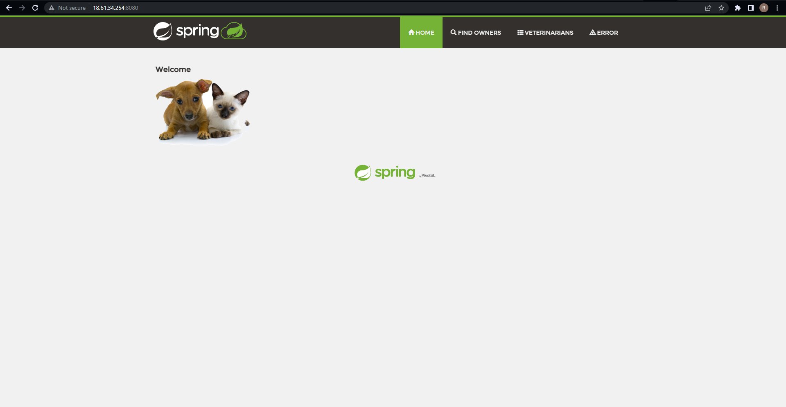

### Containerize the Java (Spring boot) Application
----------------------------------------------------

* **Spring boot:** This helps in building web based java applications with built in middleware
* Generally to extension of the java package is jar to run the spring boot application the command is java -jar <package>.jar
* Let's try to run an application spring-petclinic
* To run this application we need java 11
* When we run this application, it exposes port 8080

> Approach 1 - Creating a container image using Dockerfile

* [Refer Here](https://docs.docker.com/engine/reference/builder/) for all the Dockerfile instructions
* For this activity, let's stick closer to the manual Approach
    * Pick a base image => ubuntu:22.04
    * spring-petclinic runs on port 8080

### Manual steps
```bash
sudo apt update
sudo apt install openjdk-11-jdk -y
wget https://referenceapplicationskhaja.s3.us-west-2.amazonaws.com/spring-petclinic-2.4.2.jar
java -jar spring-petclinic-2.4.2.jar
```

* To access the petclinic application navigate to ```http://<public-ip>:8080```



* On a highlevel, to choose a base image, the instruction is **FROM**
* To execute any commands, to install/configure application, the instruction is **RUN**
* To expose the port, the command is **EXPOSE**
* To start the application when a container is created, the instruction is **CMD**

* Let's try a Dockerfile for the same
```Dockerfile
FROM ubuntu:22.04
RUN apt update
RUN apt install openjdk-11-jdk wget -y
RUN wget https://referenceapplicationskhaja.s3.us-west-2.amazonaws.com/spring-petclinic-2.4.2.jar
EXPOSE 8080
CMD ["java", "-jar", "/spring-petclinic-2.4.2.jar"]
```

* Next, onto your linux m/c, create a file with exact name as Dockerfile inside a new folder and copy the above contents. 

* Create a docker image and list all the images using following commands
```bash
docker image build -t spc_one:1.0 .
docker image ls
```

* Now, Lets create a container in a detached mode with the name processone
```bash
docker container run -d --name processone -p 8081:8080 spc_one:1.0
```
* Verify, if the container is up & running which is more important as a beginner
```bash
docker container ls
```
* If, you can't find your conatiner using the above command, then there might be some issues with your steps
* However, the below command will list down all the containers whether stopped/paused/running/etc
```bash
docker container ls -a
```

* And if everything's fine then access your application using ```http://<public-ip>:8081```

> Approach 2

* To run spring-petclinic, we need java 11, but in the previous image we used ubuntu which is not necessary
* Let's use _[amazoncorretto](https://hub.docker.com/_/amazoncorretto)_ image from the DockerHub registry
* **ADD** instruction is used to copy the files into images

```Dockerfile
FROM amazoncorretto:11
ADD https://referenceapplicationskhaja.s3.us-west-2.amazonaws.com/spring-petclinic-2.4.2.jar /spring-petclinic-2.4.2.jar
EXPOSE 8080
CMD ["java", "-jar", "/spring-petclinic-2.4.2.jar"]
```

* Build and list the image
```bash
docker image build -t spc_two:1.0 .
docker image ls
```

* Create the container from the above built image
```bash
docker container run -d --name processtwo -p 8082:8080 spc_two:1.0
```
* Access the application as we've been doing ```http://<public-vm>:8082```
* Generally, all the Image publishers in DockerHub have slim options which further reduces the size of container on the disk

### Exercise:
* Try using amazoncorreto:11-alpine-jdk as base image and build spc_three
* Try [game-of-life](https://github.com/wakaleo/game-of-life)
* Download [war](https://referenceapplicationskhaja.s3.us-west-2.amazonaws.com/gameoflife.war) file for Game of Life Application
    * To run this application we need tomcat 9 or 8 with java 8
    * This application runs on port 8080 => ```http://<public-vm>:<port>/gameoflife```

> *NOTE: copy the gameoflife.war into webapps folder of tomcat*
